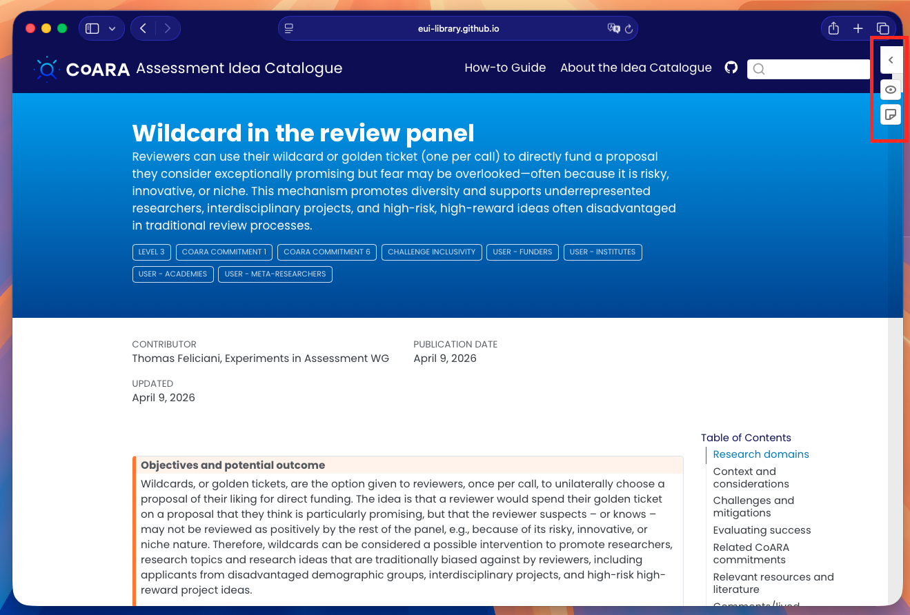
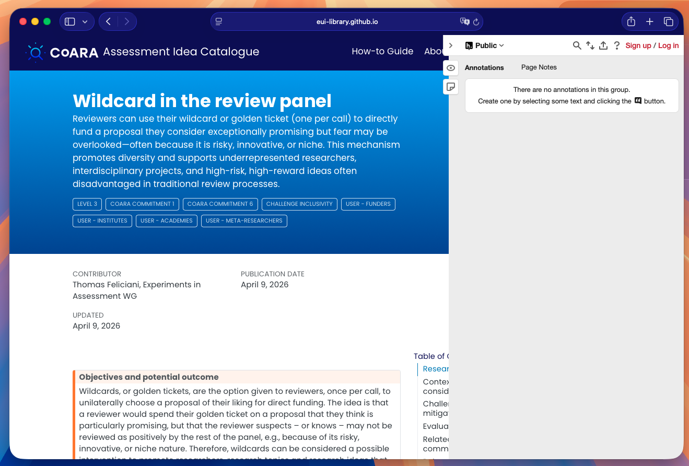
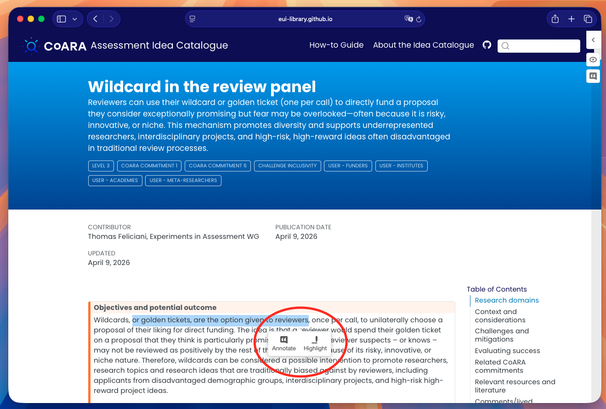
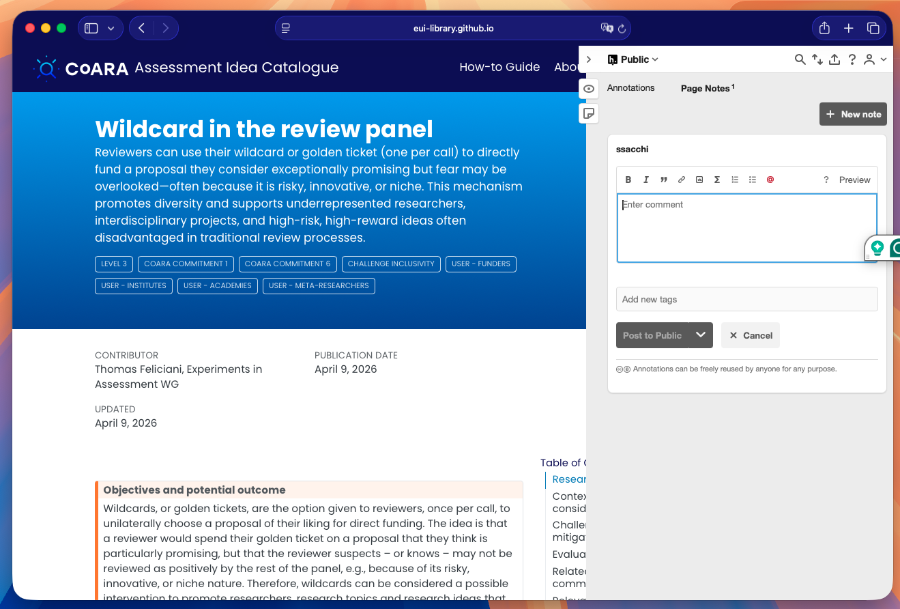

# Annotating with Hypothesis on the CoARA Assessment Idea Catalogue

> **What is Hypothesis?** [Hypothesis](https://web.hypothes.is/) is an open-source web annotation tool embedded directly in this site. It lets you highlight text, add comments, and share notes — publicly or within a group — without leaving the page. 

**You can use Hypothesis to add comments and feedback to all idea and other pages of the CoARA Assessment Idea Catalogue**

---

## 1. The Hypothesis sidebar

When you open any page of the [CoARA Assessment Idea Catalogue](https://eui-library.github.io/coara-idea-catalogue/), you will notice two small icons on the **right-hand edge** of the browser window:

| Icon | Action |
|------|--------|
|   | Show / hide existing annotations on the page                   |
|  | Open the full Hypothesis sidebar panel to add a new annotation |

Click the **arrow ( › )** at the top of the icon strip, or either icon, to expand the sidebar.

---

## 2. Creating a free Hypothesis account

To annotate you need a (free) Hypothesis account.

1. Click **Sign up / Log in** in the top-right corner of the sidebar.
2. Choose **Sign up** and complete the registration form on [hypothes.is](https://hypothes.is/signup).
3. Return to the catalogue page — you will now be logged in automatically.

> **Tip:** You can also log in with an existing Google account.

---

## 3. Adding an annotation (inline comment)

1. **Select** any text on the page by clicking and dragging over it.
2. A small toolbar appears above the selection with two buttons: **Annotate** and **Highlight**.

3. Click **Annotate** to open the annotation editor in the sidebar.
4. Type your comment in the text box. You can use **Markdown** for formatting (bold, lists, links, etc.).
5. Optionally add **tags** to categorise your annotation.
6. Choose the visibility:
   - **Public** — visible to everyone with Hypothesis.
   - **Only me** — private note.
   - **Group** — visible only to members of a shared group (see §5).
7. Click **Post to Public** (or the relevant group) to save.

The annotated text will appear **highlighted in yellow** on the page; clicking it reopens the annotation in the sidebar.

---

## 4. Adding a Page Note

A **Page Note** is a comment on the page as a whole, not anchored to specific text.

1. Open the Hypothesis sidebar.
2. Click the **Page Notes** tab.
3. Click the **pencil / new note** button.
4. Write your note and post it (same visibility options as annotations).

---

## 5. Highlighting without a comment

1. Select some text.
2. Click **Highlight** in the popup toolbar.

The text is highlighted in your personal view immediately. Highlights are **private by default** — they are visible only to you when logged in.

---

## 6. Replying to an existing annotation

1. Open the sidebar (annotations from others appear listed automatically when you load the page).
2. Click any annotation to expand it.
3. Click **Reply** below the annotation text.
4. Type your response and post it.

---

## 7. Annotation groups

If you are working collaboratively, you can create or join a **Hypothesis group** to share annotations only with your team:

1. Click the group selector at the top of the sidebar (it shows **Public** by default).
2. Choose **New private group** or paste an invite link shared by a colleague.
3. All future annotations posted to this group will be visible only to members.

---

## 8. Sharing a single annotation

Each annotation has a permanent link you can share:

1. Open the annotation in the sidebar.
2. Click the **share** icon (arrow pointing up) or the timestamp link.
3. Copy the URL and share it — it will scroll the recipient to the exact passage.

---

## Quick reference

| Task | How |
|------|-----|
| Open sidebar | Click the **›** arrow or the icons on the right edge |
| Log in | Click **Sign up / Log in** in the sidebar header |
| Annotate text | Select text → **Annotate** → write comment → **Post** |
| Highlight text | Select text → **Highlight** |
| Add a page note | **Page Notes** tab → pencil icon → write → **Post** |
| Reply | Click an annotation → **Reply** |
| Change visibility | Use the group/visibility dropdown before posting |
| Share an annotation | Click the share icon inside an annotation card |

---

*For more information on Hypothesis, visit the [Hypothesis Help Centre](https://web.hypothes.is/help/).*
